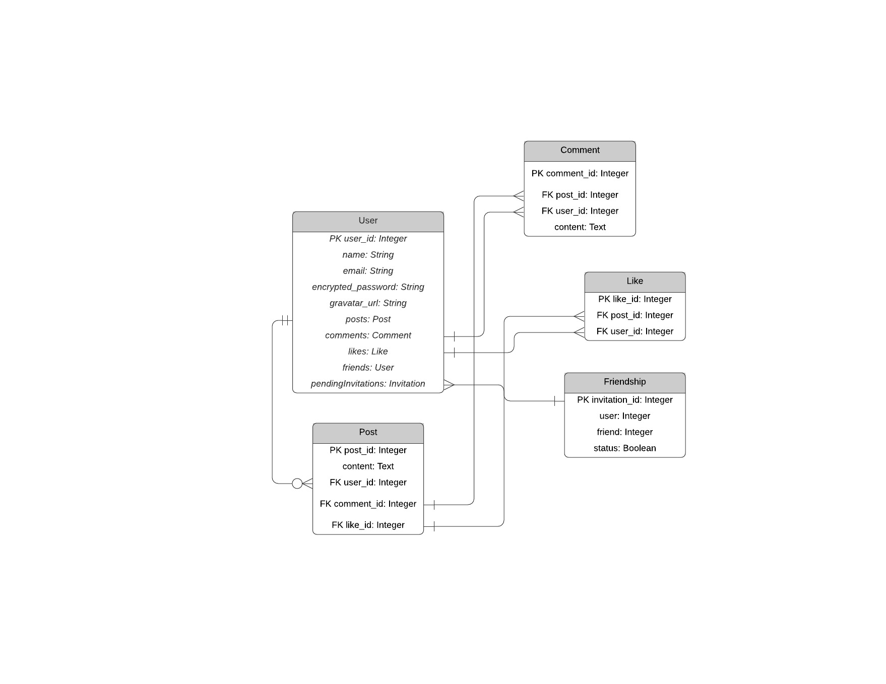
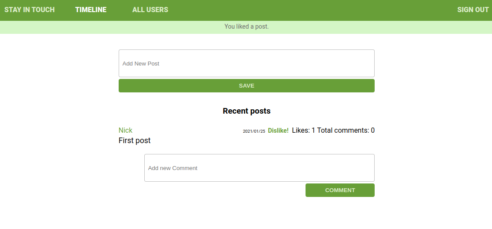

# Social media app with Ruby on Rails

This is a social media app with basic styling.
Users can write posts and invite another users to be their friends.
Users can only see their posts and posts from their friends, and they can also like or comment other posts.

## Built With

- Ruby v2.7.0
- Ruby on Rails v5.2.4

## Live Demo

[Heroku version](https://secret-beach-83312.herokuapp.com/)

## Getting Started

To get a local copy up and running follow these simple example steps.

### Prerequisites

- Ruby: 2.6.3
- Rails: 5.2.3
- Postgres: >=9.5

### Setup

Install gems with:

```
bundle install
```

Setup database with:

```
   rails db:create
   rails db:migrate
```

### Github Actions

To make sure the linters' checks using Github Actions work properly, you should follow the next steps:

1. On your recently forked repo, enable the GitHub Actions in the Actions tab.
2. Create the `feature/branch` and push.
3. Start working on your milestone as usual.
4. Open a PR from the `feature/branch` when your work is done.


### Usage

Start server with:

```
    rails server
```

Open `http://localhost:3000/` in your browser.

### Run tests

```
    rpsec --format documentation
```

You can run multiple rspec tests to check for the validity of the model and the different features.

### Documentation

This is the database model:



To use the application you need to create an user.
After that you will be redirected to the timeline where you will be able to see all your posts and posts from your friends.
Here you can comment or like any post.

You can go to the all users page too, where you will see all the users of the application.
Here you can send friend requests and accept or reject friendship requests from other users.



## Authors

👤 **Nick Kuria**
- GitHub: [@Nkuria](https://github.com/Nkuria)
- LinkedIn: [LinkedIn](https://www.linkedin.com/in/nkuria)

👤 **Angel Barros**

- GitHub: [@Zappat0n](https://github.com/Zappat0n)
- LinkedIn: [LinkedIn](https://www.linkedin.com/in/angel-barros/)

## 🤝 Contributing

Contributions, issues and feature requests are welcome!

Feel free to check the [issues page](issues/).

## Show your support

Give a ⭐️ if you like this project!

